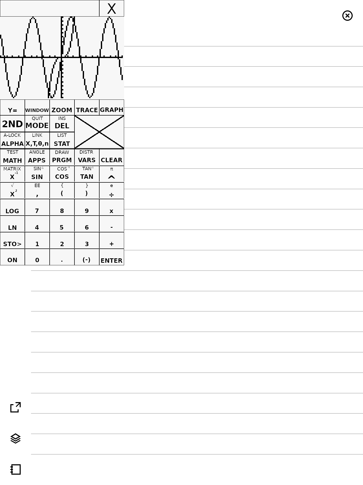

reMarkable Stuff
================
[](https://github.com/timower/rM2-stuff/actions/workflows/build.yml)
[](https://codecov.io/github/timower/rM2-stuff)

Collection of reMarkable related apps, utilities and libraries.

Different font sizes and support for Polish chars on Folio keyboard
-------------------------------------------------------------------

_All of this was done by Claude, Codex and me (5%). Look into `docs` folder for very detailed description._

### Build

Clone repo and run:

```
./scripts/test-fonts.sh
```
to build following variants of yaft:

**Font variants** (all  Polish support — żółćęśąźń ŻÓŁĆĘŚĄŹŃ):

| Binary | Cell size | Cols × Rows (rM2 1404×1872) |
|--------|-----------|------------------------------|
| `yaft-terminus-16x32` | 16×32 | 87 × 58 (original, small) |
| `yaft-terminus-24x48` | 24×48 | 58 × 39 ★ recommended |
| `yaft-terminus-28x56` | 28×56 | 50 × 33 |
| `yaft-terminus-32x64` | 32×64 | 43 × 29 |
| `yaft-spleen-16x32`   | 16×32 | 87 × 58 |
| `yaft-spleen-32x64`   | 32×64 | 43 × 29 (currently deployed) |

### Copy to RM2

Transfer them to your Remarkable2, e.g:

```
scp build/font-test/yaft-terminus-24x48 root@10.11.99.1:/home/root/

```

### Make a new item in the launcher menu

I use *remux* launcher.

Create a file in `/opt/etc/draft/yaft-24x48.draft` with following content:

```
name=yaft-24x48
desc=Framebuffer terminal emulator with bigger font
call=/opt/bin/yaft-terminus-24x48
term=:
imgFile=yaft
```
Bring remux menu with gesture and you will see 'yaft-24x48' item, select it to run.

Polish characters are available on Folio with RightAlt+<letter>, e.g. `ą` - `RightAlt+a`.


Projects
--------

### rm2fb
[](https://support.remarkable.com/s/article/Software-release-2-15-October-2022)
[](https://support.remarkable.com/s/article/Software-release-3-3)
[](https://support.remarkable.com/s/article/Software-release-3-5)
[](https://support.remarkable.com/s/article/Software-release-3-8)
[](https://support.remarkable.com/s/article/Software-release-3-20)
[](https://support.remarkable.com/s/article/Software-release-3-22)
[](https://support.remarkable.com/s/article/Software-release-3-23)


Custom implementation for [reMarkable 2 framebuffer](https://github.com/ddvk/remarkable2-framebuffer).
The differences are:
 * Lower level hooking, removing the Qt dependence.
 * Uses UNIX sockets instead of message queues. Makes it easier to implement synchronized updates.
 * Supports less but newer xochitl versions

### [Yaft](apps/yaft)

A fast framebuffer terminal emulator.


To use simply execute `yaft` or `yaft <command..>`.
More usage information can be found in the yaft [Readme](apps/yaft).

### Rocket

Launcher that uses the power button to show.


When pressing the power button, the app drawer will be shown with a timeout of 10 seconds.
After 10 seconds the device will go to sleep, unless an app is picked before that timeout.
You can also interrupt the timeout by pressing the `[x]` button.

This allows you to switch apps without relying on gestures.

### Tilem

A TI-84+ calculator emulator for the remarkable.



To use simply execute `tilem`, a prompt for downloading a ROM file will be shown.
If you already have a ROM file, you can pass it as an argument on the command line.

### rMlib

Library for writing remarkable apps.
Includes an extensive declarative UI framework based on Flutter.

### [NixOS](nix/)

A [NixOS](https://nixos.org) module that allows soft-rebooting into NixOS. This
allows to declaratively manage your reMarkable 2 configuration.

### SWTCON

This lib contains a reverse engineered software TCON. It currently still relies
on some functions from `xochitl`, namely the generator thread routine.
To use these functions it must be launched as an `LD_PRELOAD` library attached to xochitl.
The `swtcon-preload` tool is an example of how it can be currently used.


Building
--------

Building for the remarkable can either use the [toltec toolchain](https://github.com/toltec-dev/toolchain)
or the reMarkable one:
```bash
# For toltec:
$ cmake --preset dev-toltec
# For remarkable:
$ cmake --preset dev

# To build everything:
$ cmake --build build/dev
# Or to build a specific app:
$ cmake --build build/dev --target yaft

# To create an ipk file:
$ cmake --build build/dev --target package
```

Emulating
---------

For faster development an `EMULATE` mode is supported by rMlib. This allows
running most apps on a desktop using SDL to emulate the remarkable screen.
To enable it pass `-DEMULATE=ON` to the cmake configure command, without using
the reMarkable toolchain of course.
```bash
$ cmake --preset dev-host
$ cmake --build build/host --target yaft
$ ./build/host/apps/yaft/yaft # Should launch Yaft with an emulated screen in a separete window.
```
